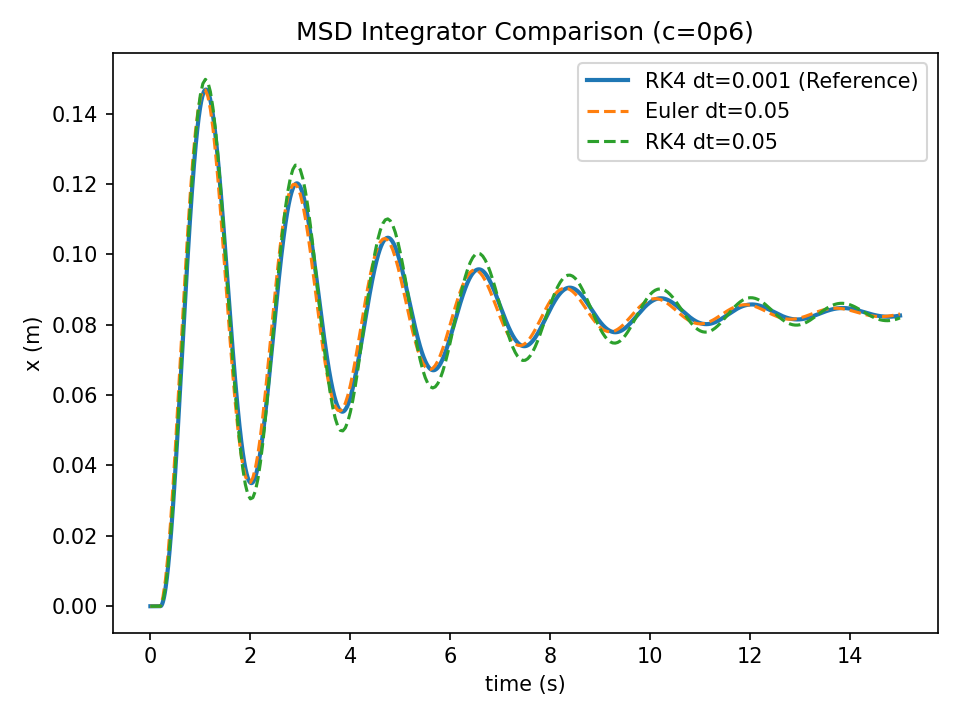

# Mass–Spring–Damper (MSD) Simulation — Euler vs RK4

## Overview

This project implements a 1D mass–spring–damper system:

$$
m\ddot{x} + c\dot{x} + kx = u(t)
$$

and compares two numerical integrators:
* **Semi-implicit Euler** (energy-dissipative baseline)
* **Runge–Kutta 4 (RK4)** (higher-order integrator)

The objective is to evaluate:
* Stability behavior
* Transient fidelity
* Numerical damping effects
* Sensitivity to timestep size

The simulation generates:
* CSV time-series logs
* Automated plots
* Quantitative metrics (overshoot, settling time, steady-state error)

---

## Problem

Second-order physical systems must be discretized for digital simulation and control

The key questions explored:
* How does timestep size (`dt`) affect solution accuracy?
* How do integrators behave in:
  * near-critical damping (clean settling)
  * underdamped oscillatory systems?
* Does the numerical method introduce artificial damping or phase distortion?

---

## Approach

### Dynamics
State formulation:

$$
\dot{x} = v
$$

$$
\dot{v} = \frac{u - c v - k x}{m}
$$

Energy sanity check:

$$
E(t) = \frac{1}{2} m v^2 + \frac{1}{2} k x^2
$$

---

### Integrators
* **Semi-implicit Euler**
  * First-order
  * Adds numerical damping in oscillatory systems
* **RK4**
  * Fourth-order
  * Better trajectory fidelity at moderate timesteps

---

### Experimental Matrix
Two damping regimes:
* **Case A (near critical damping):** `c = 7`
* **Case B (underdamped oscillatory):** `c = 0.6`

Two timestep sizes:
* `dt = 0.001` (high fidelity reference)
* `dt = 0.05`  (coarse timestep stress test)

Total: **8 simulations**

---

## Results
### Clean settling case (c = 7)
Euler and RK4 are nearly identical at small timestep.

At coarse timestep, Euler shows slight numerical damping but remains stable.

| Case     | Integrator | Settling Time (2%) | Overshoot |
| -------- | ---------- | ------------------ | --------- |
| dt=0.001 | Euler      | 1.921 s            | 0         |
| dt=0.001 | RK4        | 1.918 s            | 0         |
| dt=0.05  | Euler      | 2.05 s             | 0         |
| dt=0.05  | RK4        | 1.90 s             | 0         |

---

### Underdamped case (c = 0.6)
At small timestep, Euler ≈ RK4 (baseline accuracy).

At coarse timestep:
* Euler exhibits **artificial numerical damping**
* RK4 preserves oscillatory behavior but shows **phase/amplitude distortion**

| Case     | Integrator | Peak Overshoot | Settling Time |
| -------- | ---------- | -------------- | ------------- |
| dt=0.001 | Euler      | 0.7609         | 13.06 s       |
| dt=0.001 | RK4        | 0.7617         | 13.07 s       |
| dt=0.05  | Euler      | 0.7602         | 12.95 s       |
| dt=0.05  | RK4        | 0.7966         | 15.00 s       |

---

### High-Fidelity Reference Comparison
RK4 with dt=0.001 is treated as the reference trajectory.

Coarse timestep simulations (dt=0.05) are compared against it.

This highlights:
- Numerical damping introduced by semi-implicit Euler
- Phase/amplitude distortion at coarse timestep
- Sensitivity of oscillatory systems to timestep size

---

### Engineering Interpretation

For lightly damped systems, timestep selection directly impacts transient fidelity.

Semi-implicit Euler introduces artificial damping that reduces oscillation amplitude and accelerates decay.

RK4 preserves the oscillatory structure more accurately but requires adequate timestep to avoid phase and amplitude error.

This demonstrates that integrator choice and timestep size materially affect simulation fidelity in control and robotics applications.

---

## Generated Outputs

After running:

**Data**

* `data/msd_c*_dt*_euler.csv`
* `data/msd_c*_dt*_rk4.csv`

**Plots**

* `plots/msd_reference_c*.png`
* `plots/msd_c*_dt*.png`
* `plots/msd_energy_c*_dt*.png`
* `plots/msd_diff_c*_dt*.png`

---

## Build & Run

```bash
cmake -S . -B build
cmake --build build
./build/msd_sim
python scripts/plot.py
python scripts/plot_overlay.py
```

Windows (PowerShell):

```powershell
cmake -S . -B build
cmake --build build
.\build\Debug\msd_sim.exe
python .\scripts\plot.py
python .\scripts\plot_overlay.py
```

---

## Key Takeaways

* Integrator selection affects transient accuracy.
* Coarse timesteps distort oscillatory dynamics.
* Semi-implicit Euler introduces numerical damping.
* RK4 improves fidelity but remains timestep-sensitive.
* Energy tracking provides a useful diagnostic check.
